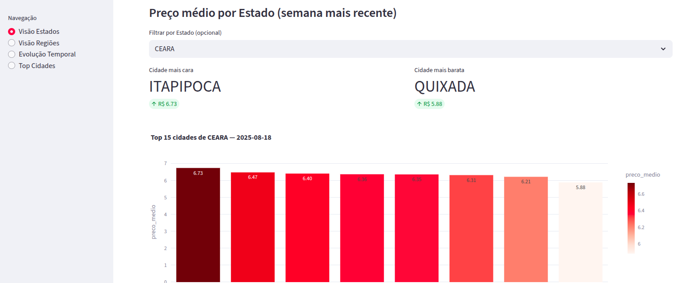
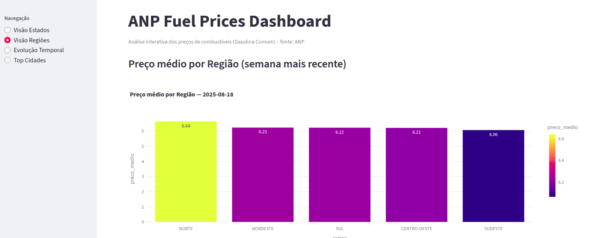
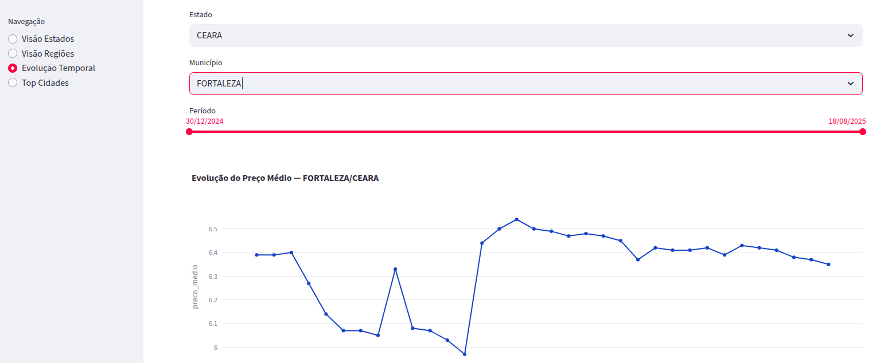
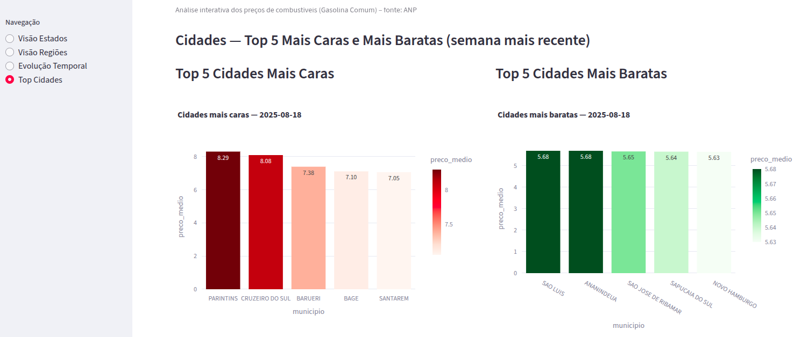

# Brazilian Fuel Prices ETL (ANP Data Pipeline)

Pipeline de dados para ingestão, tratamento e modelagem dos preços de combustíveis da ANP (camadas **Bronze**, **Silver** e **Gold**), orquestrado com **Apache Airflow** e containerizado com **Docker**.

---

## Tecnologias
- **Apache Airflow** (orquestração)
- **PostgreSQL** (metastore)
- **dbt** (modelagem de dados)
- **Streamlit / Metabase** (dashboards)
- **Docker & Docker Compose** (infraestrutura)

---

## Arquitetura


---

## Estrutura de Pastas
```
anp-fuel-etl/
├── dags/              # DAGs do Airflow
├── etl/               # Scripts ETL (bronze, silver, gold)
├── dbt_project/       # Projeto dbt
├── dashboards/        # Visualizações (Streamlit/Metabase)
├── data/              # Dados locais
│   ├── bronze/
│   ├── silver/
│   └── gold/
├── docker/            # Infraestrutura (compose, Dockerfile)
├── config/            # Configurações
├── docs/              # Documentação (diagramas, imagens, etc.)
│   └── architecture.png
└── README.md
```

---

## Como rodar o projeto

1. **Clone o repositório**
   ```bash
   git clone https://github.com/seu-usuario/anp-fuel-etl.git
   cd anp-fuel-etl/docker
   ```

2. **Suba os serviços com Docker Compose**
   ```bash
   docker-compose up -d --build
   ```

3. **Acesse o Airflow**
   - URL: [http://localhost:43921](http://localhost:43921)  
   - Usuário: `admin`  
   - Senha: `admin`

---

## Status do Projeto
- [x] Estrutura inicial do repositório
- [x] Docker + Airflow funcionando
- [x] DAG Bronze (ingestão de dados da ANP)
- [x] DAG Silver (limpeza e padronização)
- [x] Criar a tabela silver.precos_combustiveis no Postgres a partir dos .parquet
- [x] Rodar dbt seed para carregar dim_regiao_estado.csv
- [x] Rodar dbt run para materializar os modelos Gold
- [x] DAG Gold (modelagem dbt)
- [x] Realizar testes unitários
- [x] Dashboards (Streamlit)

---

## 📊 Prints do Dashboard





## 🎥 Demonstração em GIF
[Assista ao vídeo da demonstração](docs/video_projeto.mp4)